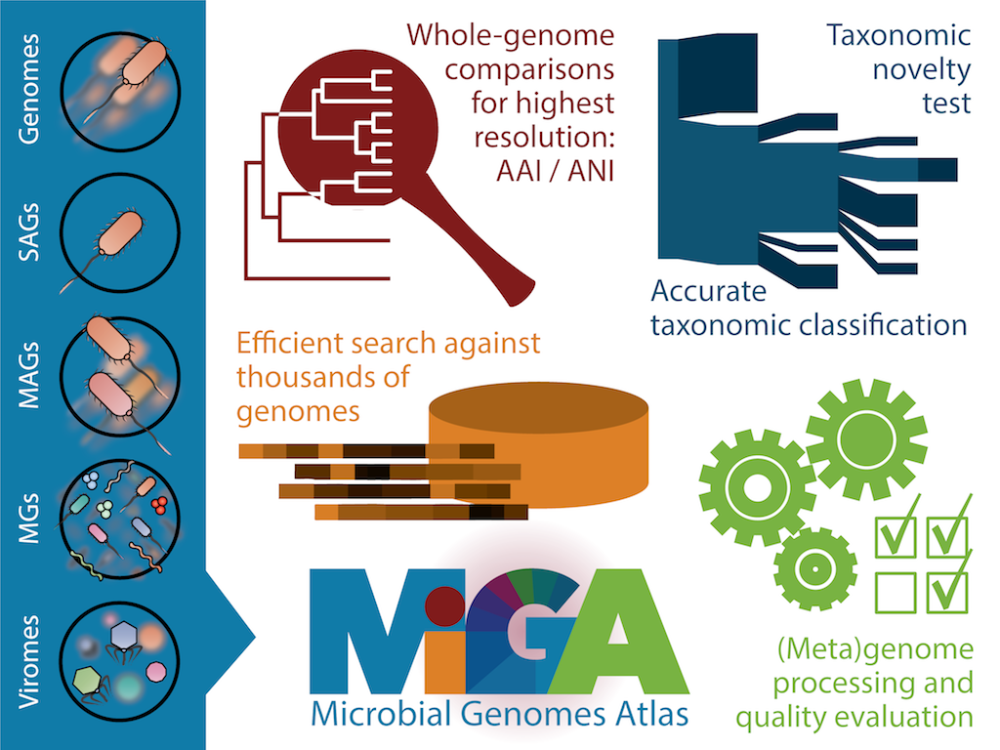

# MiGA: Microbial Genomes Atlas

For additional information on MiGA, visit:

* [MiGA users list][mailing-list]:
  Forum to discuss with other users and developers.
* [MiGA manual][gitbook]: The definitive guide to MiGA.
* [MiGA API docs][rubydoc]: Inner-workings of the `miga-base` gem.
* [MiGA Web][miga-web]: MiGA on Rails!

# For the impatient

If you're like us, you probably want to see sofware in action from the get go.
You have two options:

1. Get a peak on MiGA using [MiGA Online][miga-online].
2. Install the [requirements](manual/part2/requirements.md) and follow the
  [installation instructions](manual/part2/installation.md). Once you have MiGA
  installed, you can [deploy some examples](manual/part4.md).

# How to cite MiGA

> Rodriguez-R *et al*. 2018. The Microbial Genomes Atlas (MiGA) webserver:
> taxonomic and gene diversity analysis of Archaea and Bacteria at the whole
> genome level. *Nucleic Acids Research* 46(W1):W282-W288.
> [doi:10.1093/nar/gky467](https://doi.org/10.1093/nar/gky467).

# Authors

Developed and maintained by [Luis M. Rodriguez-R][lrr]. MiGA is the result of a
collaboration between [Kostas Lab][kostas] at the Georgia Institute of
Technology and [RDP][rdp] at Michigan State University.

# License

See [LICENSE](LICENSE).

[lrr]: http://lmrodriguezr.github.io/
[mailing-list]: https://groups.google.com/forum/#!forum/miga-users
[gitbook]: https://miga.gitbooks.io/miga/content/
[rubydoc]: http://www.rubydoc.info/github/bio-miga/miga
[contact]: http://enve-omics.gatech.edu/node/7
[miga-web]: https://github.com/bio-miga/miga-web
[miga-gui]: https://github.com/bio-miga/miga-gui
[miga-online]: http://microbial-genomes.org/
[kostas]: http://enve-omics.gatech.edu/
[rdp]: http://rdp.cme.msu.edu/
