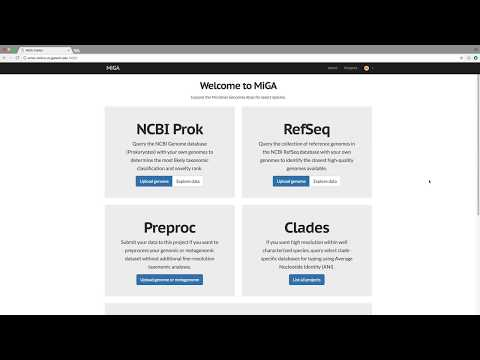
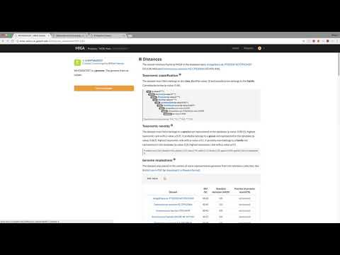
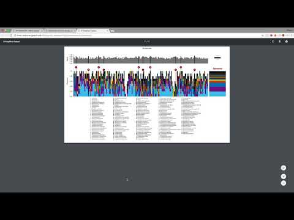

# MiGA Web

MiGA Web allows you to explore and query your projects directly from the
browser. We provide a publicly available server including several
general-purpose projects as well as some clade-specific ones:
[MiGA Online](http://microbial-genomes.org/). For an introduction on MiGA
Online, take a look at these video tutorials:

## Introduction

## Choosing the Right Analysis

## Understanding Taxonomy

## Evaluating Quality

## Deploying MiGA Web

If you want to host your own MiGA server, or just launch one from your own
computer to simplify browsing results, take a look at the instructions
to [deploy MiGA Web](http://code.microbial-genomes.org/miga-web).

